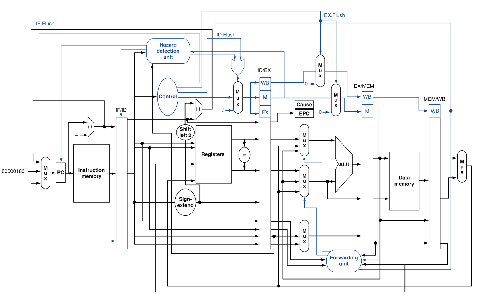

# :computer: MIPS Pipeline Processor simulator



## Usage

### Clone or Download
Clone or Download project as a zip file and import to your python environment

### Code with binary instructions
Edit "Instruction.txt" file and insert your binary codes like this:
```binary
00000001000010010101000000100000
00010001001010100000000000000011
00000001000010010101000000100010
```

### CPU.py
Just import CPU.py to your main file and create MIPS CPU:
```python
import CPU

mips = CPU.MIPS('instruction.txt')
```

### Opcodes
Please check opcodes.py and functs.py that is equivalent with your architecture.
